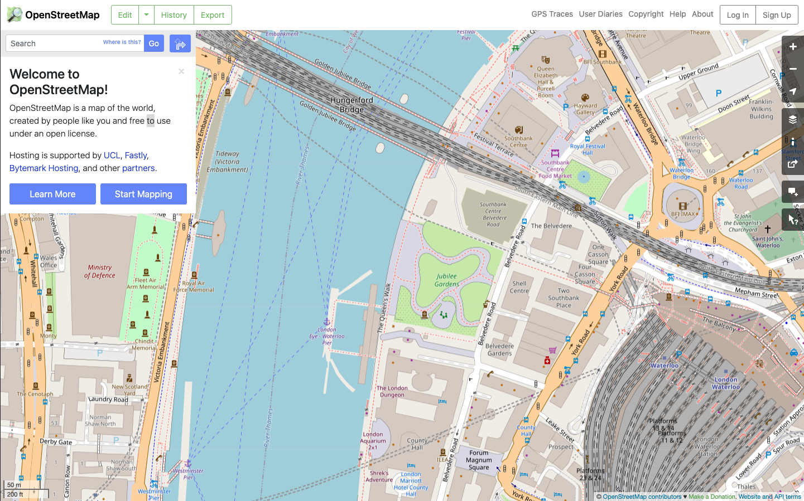
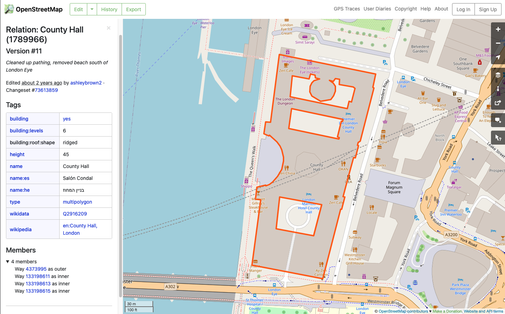

# ARLAS-stack-OSM-tutorial

## About this tutorial
### What will you learn ?
With this tutorial, you'll be able to:

- start an ARLAS-Exploration stack
- Index some OSM data in Elasticsearch
- Reference the indexed birdtracking data in ARLAS
- Create a dashboard to explore the OSM data using ARLAS-wui-builder

### What will you need ?

You will need :

- docker & docker-compose
- curl

### What will you get ?

## OSM data

OpenStreetMap (OSM) is a collaborative project to create a free editable geographic database of the world.
Over two million registered users participate in the growth of the project by collecting data using manual survey, GPS devices, aerial photography, and other free sources, or use their own local knowledge of the area.

The data entered on OSM can be :

- Polygons
- Linestrings
- Points

representing differents cartographic elements : buildings, parks, railways, rivers, roads, shops, theaters, ...

<p align="center">
    
</p>

Each element has several metadata attributes set by the contributor

<p align="center">
    
</p>

The purpose of this tutorial is to obtain a geo-analytic view of this data. A fluid exploration that can instantly answer questions such as:

- How many buildings are in my country, state or city? And how are they distributed geographically?
- What are the different existing types of buildings? With what proportions?
- When this data has been created/updated?

Let's do that for your country, state or city !

### Download data

Go to `http://download.geofabrik.de/` and choose the `pbf`* file of your country/region

For example, let's download Scotland's `pbf`* file : 

```shell
mkdir data

curl -o data/scotland.osm.pbf https://download.geofabrik.de/europe/great-britain/scotland-latest.osm.pbf
```

*: `pbf` is an OSM format to transfer vector GIS data.

```shell
docker run -v $PWD/data:/data  osgeo/gdal ogr2ogr \
    -sql 'SELECT geometry, st_x(st_centroid(geometry)) as lon, st_y(st_centroid(geometry)) as lat , st_area(ST_Transform(geometry,3857)) as area, * FROM multipolygons where building not null' \
    -dialect sqlite -t_srs crs:84 -f GeoJSONSeq /data/scotland.osm.geojson \
    /data/scotland.osm.pbf
````
