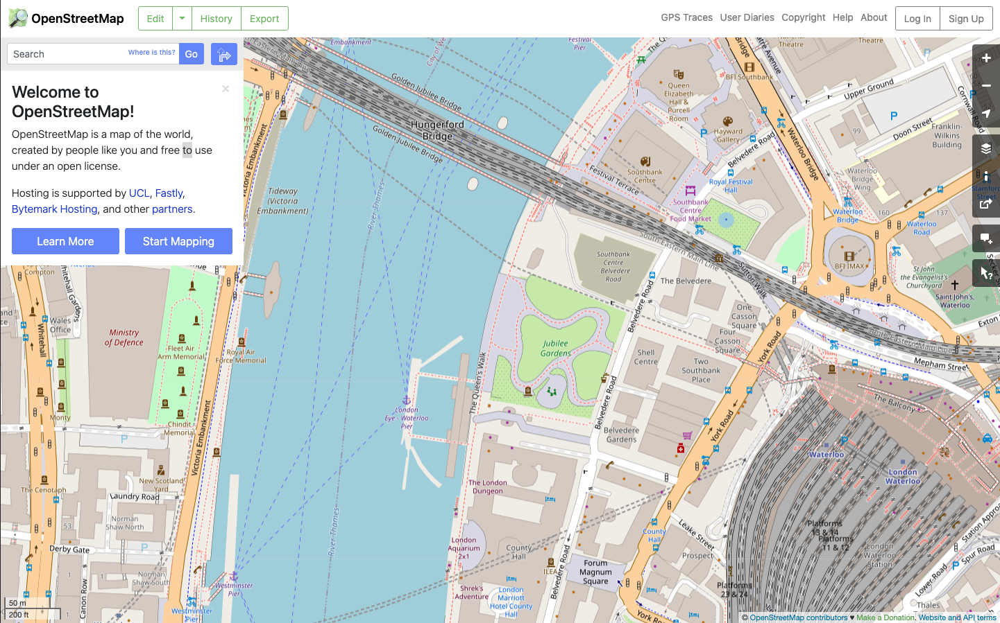
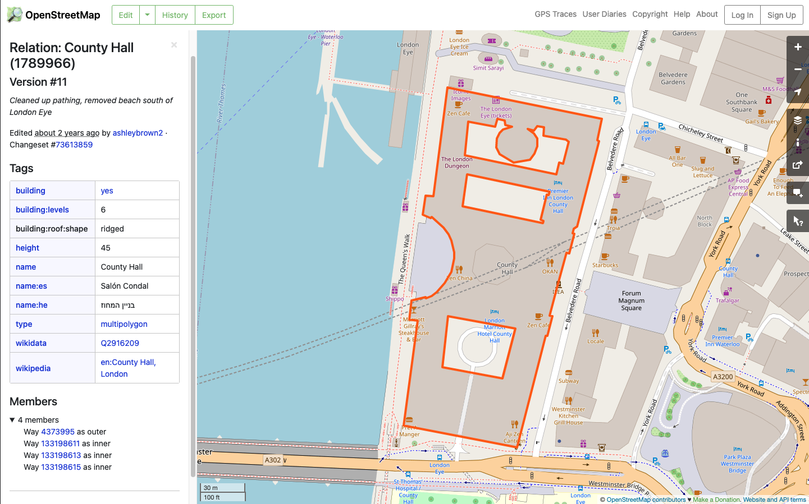

# ARLAS-stack-OSM-tutorial

## About this tutorial
### What will you learn ?
With this tutorial, you'll be able to:

- start an ARLAS-Exploration stack
- Index some OSM data in Elasticsearch
- Reference the indexed birdtracking data in ARLAS
- Create a dashboard to explore the OSM data using ARLAS-wui-builder

### What will you need ?

You will need :

- docker & docker-compose
- curl

### What will you get ?

## OSM data

OpenStreetMap (OSM) is a collaborative project to create a free editable geographic database of the world.
Over two million registered users participate in the growth of the project by collecting data using manual survey, GPS devices, aerial photography, and other free sources, or use their own local knowledge of the area.

The data entered on OSM can be :

- Polygons
- Linestrings
- Points

representing differents cartographic elements : buildings, parks, railways, rivers, roads, shops, theaters, ...

<p align="center">
    
</p>

Each element has several metadata attributes set by the contributor

<p align="center">
    
</p>

The purpose of this tutorial is to obtain a geo-analytic view of this data. A fluid exploration that can instantly answer questions such as:

- How many buildings are in my country, state or city? And how are they distributed geographically?
- What are the different existing types of buildings? With what proportions?
- When this data has been created/updated?

Let's do that for your country, state or city !

### Download data

Go to `http://download.geofabrik.de/` and choose the `pbf`* file of your country/region

For example, let's download Belgium's `pbf`* file : 

```shell
mkdir data

curl -o data/belgium.osm.pbf http://download.geofabrik.de/europe/belgium-latest.osm.pbf
```

*: `pbf` is an OSM format to transfer vector GIS data.

Let's copy `osmconf.ini` file in `data` folder

```shell
cp config/ogr2ogr/osmconf.ini data
```

Now let's transform the pbf file to `GeoJSONSeq` format using `ogr2ogr`

```shell
docker run -v $PWD/data:/data -e OSM_CONFIG_FILE=/data/osmconf.ini osgeo/gdal ogr2ogr \
    -sql "SELECT geometry, st_x(st_centroid(geometry)) as lon, st_y(st_centroid(geometry)) as lat , st_area(ST_Transform(geometry,3857)) as area, * FROM multipolygons where building not null AND ST_Intersects(geometry, ST_GeomFromText('POLYGON((4.383 50.913,4.438 50.926,4.53 50.926,4.51 50.876,4.455 50.860,4.400 50.817,4.303 50.810,4.281 50.852,4.305 50.904,4.383 50.913))'))" \
    -dialect sqlite -t_srs crs:84 -f GeoJSONSeq /data/brussels_and_airport.osm.geojson \
    /data/belgium.osm.pbf
````

## Exploration in ARLAS

### Starting the ARLAS stack

- Download the ARLAS-Exploration-stack project and unzip it

```shell
(curl -L -O "https://github.com/gisaia/ARLAS-Exploration-stack/archive/develop.zip"; unzip develop.zip; rm develop.zip)
```
- Check that the `ARLAS-Exploration-stack-develop stack` folder is downloaded

```shell
ls -l ARLAS-Exploration-stack-develop
```

Now our tutorial environment is set up.


1. Starting ARLAS Exploration Stack

```shell
./ARLAS-Exploration-stack-develop/start.sh
```

2. Indexing The downloaded Brussels data in Elasticsearch

We will create an index in Elasticsearch that will host our downloaded OSM data.

- Create `brussels_osm_index` index with `config/elasticsearch/osm_mapping.json` mapping file


```shell
curl -XPUT "http://localhost:9200/brussels_osm_index/?pretty" \
    -d @${PWD}/config/elasticsearch/osm_mapping.json \
    -H 'Content-Type: application/json'
```

The `osm_mapping.json` mapping file declares to Elasticsearch our data model.

You can check that the index is successfuly created by running the following command

```shell
curl -XGET http://localhost:9200/brussels_osm_index/?pretty
```

- Index data that is in `data/brussels_and_airport.osm.geojson` file in Elasticsearch. For that, we need Logstash as a data processing pipeline that ingests data in Elasticsearch.
 
We will use the docker image `docker.elastic.co/logstash/logstash` to index the data:

```shell
    cat data/brussels_and_airport.osm.geojson | docker run -e XPACK_MONITORING_ENABLED=false \
    --net arlas-exploration-stack-develop_esnet \
    --env ELASTICSEARCH=elasticsearch:9200  \
    --env INDEXNAME=brussels_osm_index --rm -i \
    -v ${PWD}/config/logstash/geojson2es.logstash.conf:/usr/share/logstash/pipeline/logstash.conf docker.elastic.co/logstash/logstash:7.11.2
```

- Check that ~200 000 buildings are indexed:

```shell
curl -XGET http://localhost:9200/brussels_osm_index/_count?pretty
```

3. Declaring `brussels_osm_index` in ARLAS

ARLAS-server interfaces with data indexed in Elasticsearch via a collection reference.

The collection references an identifier, a timestamp, and geographical fields which allows ARLAS-server to perform a spatial-temporal data analysis

- Create a `osm_buildings` collection in ARLAS

```shell
curl -X PUT \
    --header 'Content-Type: application/json;charset=utf-8' \
    --header 'Accept: application/json' \
    "http://localhost:81/server/collections/osm_buildings?pretty=true" \
    --data @config/arlas/collection.json
```